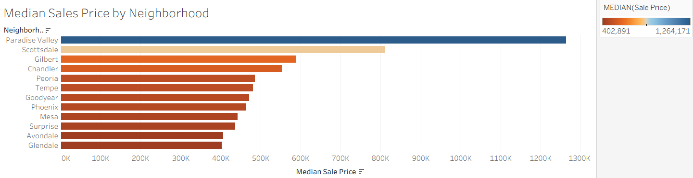
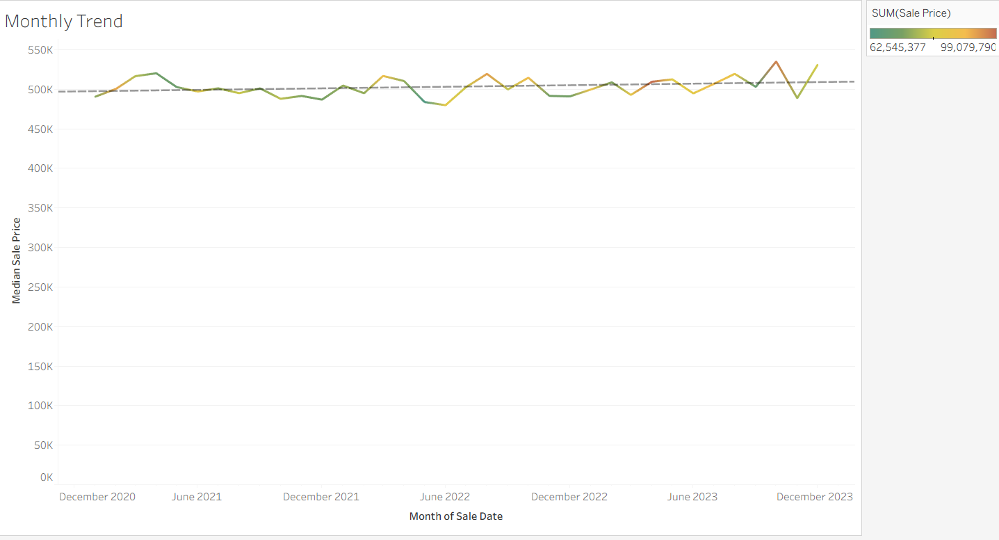
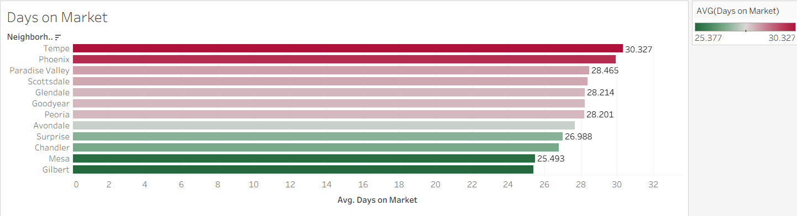
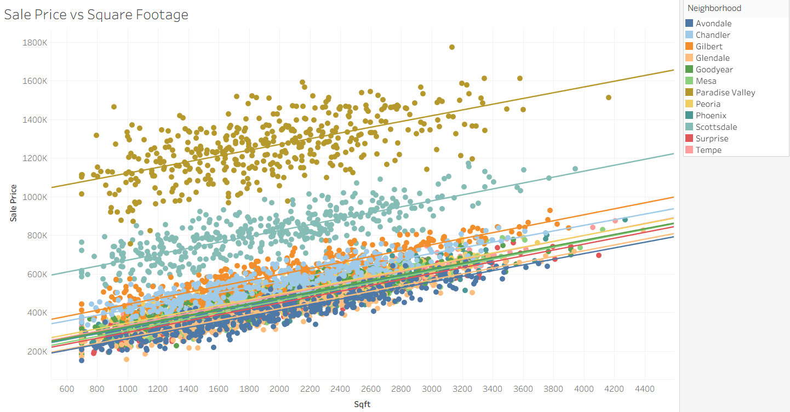
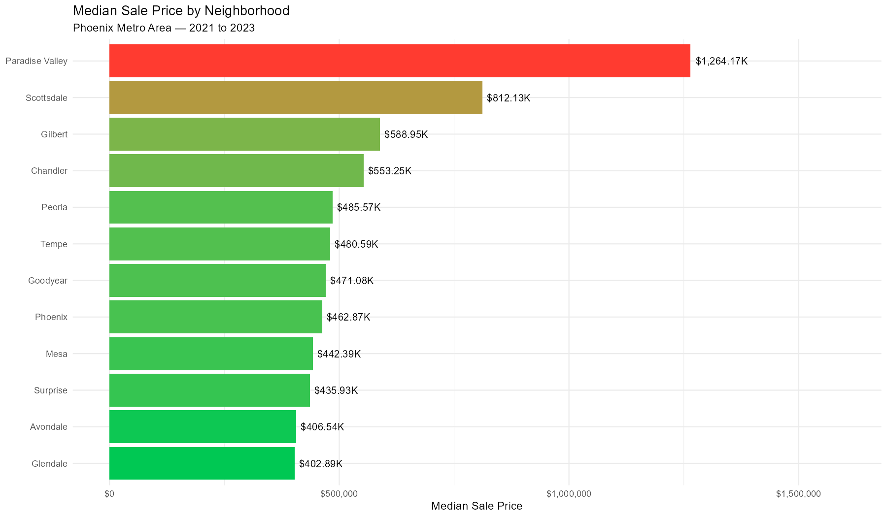
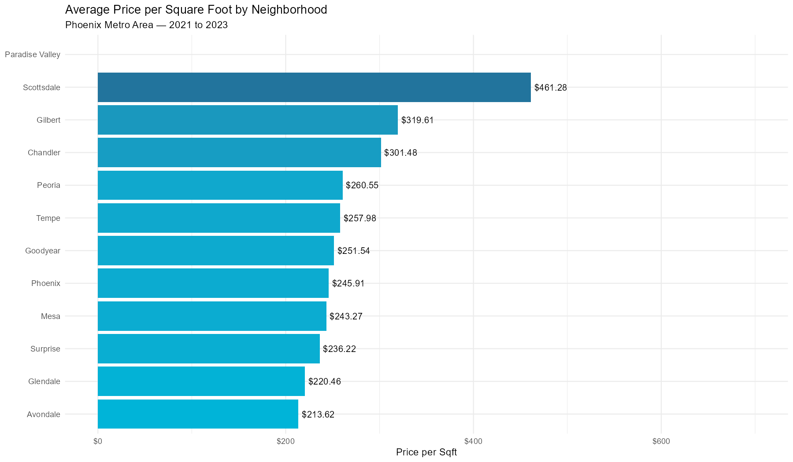
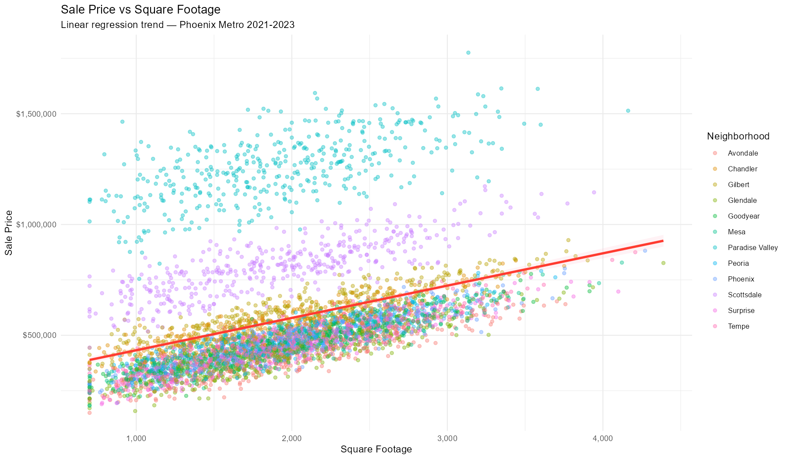
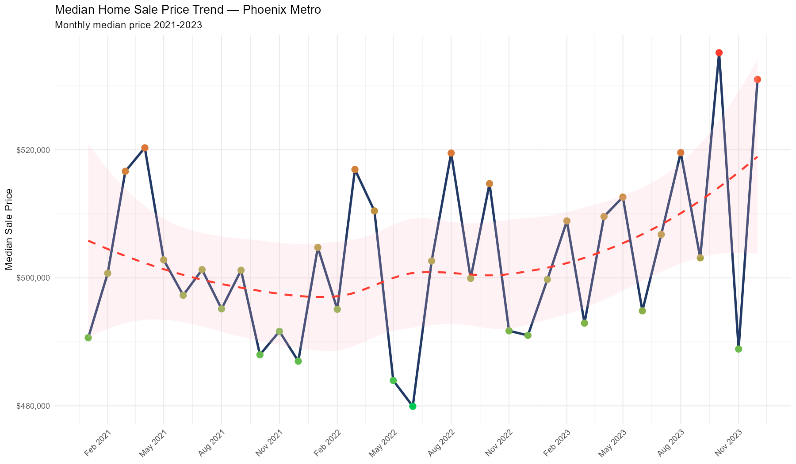
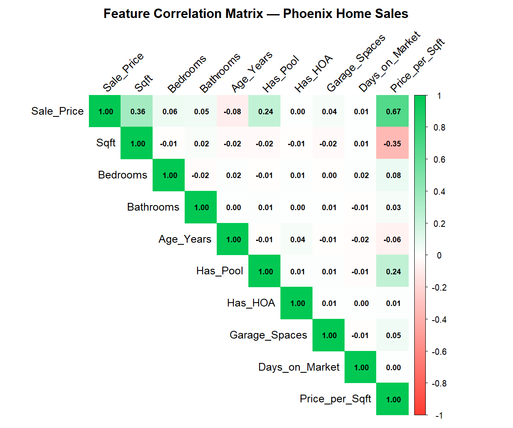

# Phoenix Metro Real Estate Analysis
**Tools:** R | Tableau  
**Data:** Simulated Phoenix Metro Home Sales — 5,000 records (2021-2023)

## Overview
Regression analysis and interactive Tableau dashboard analyzing
5,000 home sales across 12 Phoenix Metro neighborhoods.
Identifies pricing trends, market gaps, and days on market patterns.

## Tableau Dashboard

## R Analysis Charts

## Key Findings
- Paradise Valley median home price exceeds $1.2M vs $340K in Avondale — a 3.5x gap
- Price per sqft highest in Paradise Valley at $717/sqft
- Tempe has the longest average days on market
- Strong positive correlation between sqft and sale price

## Neighborhoods Analyzed
Scottsdale · Paradise Valley · Chandler · Gilbert · Tempe ·
Mesa · Glendale · Peoria · Surprise · Goodyear · Avondale · Phoenix

## Project Files
| File | Tool | Description |
|---|---|---|
| RealEstateAnalysis.R | R | Regression model & 5 ggplot2 charts |
| PhoenixRealEstateDashboard.twb | Tableau | Interactive dashboard |
| phoenix_home_sales.xlsx | Data | 5,000 home sales dataset |
| plot_*.png | R | ggplot2 visualizations |

## Skills Demonstrated
R · ggplot2 · dplyr · Regression Modeling · Tableau ·
Geographic Analysis · Real Estate Analytics · Phoenix Market

## Live Portfolio
[View Portfolio](https://nikolaszeiner.github.io/NikolasZeiner/)
